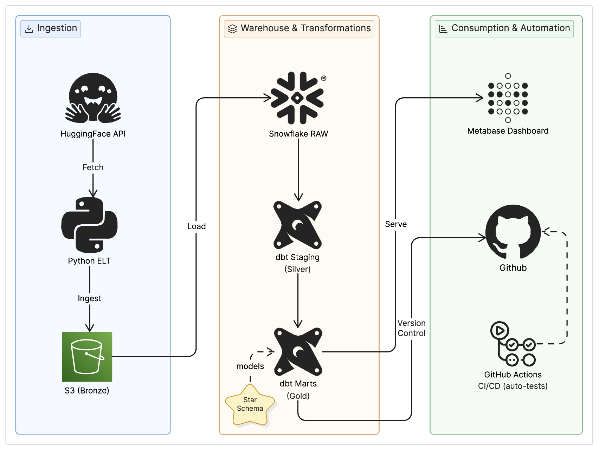
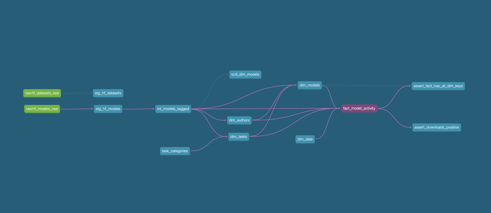
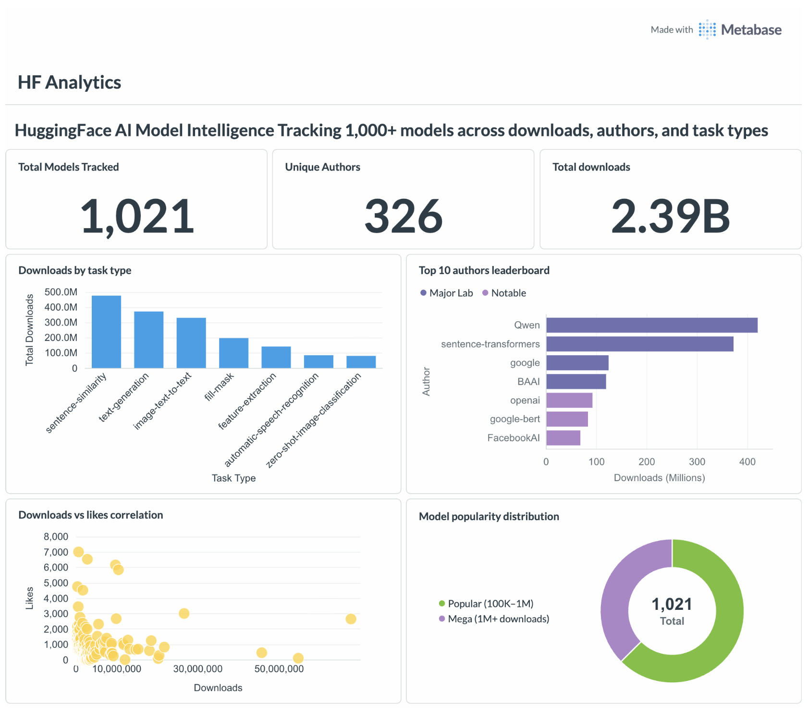

# HuggingFace AI Model Intelligence Platform using dbt + Snowflake + AWS + Metabase

[](https://www.getdbt.com/)
[](https://www.snowflake.com/)
[](https://aws.amazon.com/s3/)
[](https://www.python.org/)
[](https://www.metabase.com/)
[](https://github.com/features/actions)

## Overview

This project implements a full end-to-end data engineering and analytics engineering platform built on top of the HuggingFace Hub public API. It ingests live AI model metadata daily, loads it into Snowflake data warehouse, and transforms it into a Star Schema for business intelligence using dbt.

The pipeline follows a **Medallion Architecture** (Bronze → Silver → Gold) with a **Star Schema** in the Gold layer, orchestrated tested and deployed via **GitHub Actions CI/CD**, and visualized in **Metabase**.

> **Business Question:** Which AI model categories, libraries, and creators are dominating the open-source AI ecosystem and how is model adoption trending across tasks and time?

## Architecture

Raw data is ingested from the HuggingFace API via Python, staged in AWS S3 as the Bronze layer, loaded into Snowflake RAW schema, and transformed through dbt into analytical-ready Gold layer tables.

The project follows a **Medallion Architecture** with a **Star Schema** in the Gold layer:

- **Bronze Layer**: Raw JSON from HuggingFace API, partitioned by date in S3, loaded into Snowflake VARIANT columns
- **Silver Layer**: Cleaned, typed, and filtered staging models as dbt views
- **Gold Layer**: Star Schema — fact + dimension tables — as dbt physical tables

### Architecture Diagram

<!-- Add your architecture diagram here: docs/architecture.png -->


### Star Schema Design

- **Fact Table**: `fact_model_activity` : one row per model per ingestion day; measures downloads, likes, engagement ratio
- **Dimension Tables**: `dim_models`, `dim_authors`, `dim_tasks`, `dim_date` : descriptive attributes with surrogate keys
- **SCD Type 2**: `scd_dim_models` snapshot : tracks how model popularity changes over time without losing history

```
                    ┌─────────────┐
                    │  dim_date   │
                    └──────┬──────┘
                           │
   ┌─────────────┐  ┌──────┴──────────────┐  ┌─────────────┐
   │ dim_authors │◄─┤  fact_model_        ├─►│  dim_tasks  │
   └─────────────┘  │    activity         │  └─────────────┘
                    │  (incremental)      │
   ┌─────────────┐  └──────┬──────────────┘
   │ dim_models  │◄────────┘
   └─────────────┘
```

## Key dbt Concepts Used

### 1. Sources & Source Freshness

Sources declare where raw data lives in Snowflake's RAW schema. Freshness monitoring alerts when the pipeline hasn't delivered new data within a defined threshold.

```yaml
sources:
  - name: raw
    database: HF_ANALYTICS
    schema: RAW
    freshness:
      warn_after:  {count: 24, period: hour}
      error_after: {count: 48, period: hour}
    loaded_at_field: ingested_at
    tables:
      - name: hf_models_raw
      - name: hf_datasets_raw
```

```bash
dbt source freshness   # alerts if raw data is older than threshold
```

### 2. Models & Materializations

Models are SQL `SELECT` statements that dbt compiles into warehouse objects. Materialization strategy varies by layer.

| Layer | Materialization | Reason |
|-------|----------------|--------|
| Staging | `view` | No storage cost; always reflects latest raw data |
| Intermediate | `view` | Complex logic without storing intermediate results |
| Dimensions | `table` | Fast BI joins; rebuilt fully each run |
| Fact | `incremental` | Process only new records — efficient at scale |
| Snapshots | `snapshot` | SCD Type 2 history tracking |

### 3. Incremental Models

The fact table uses incremental materialization to process only new records on each pipeline run, avoiding full reprocessing of 1,000+ models daily.

```sql
{{ config(materialized='incremental', unique_key='activity_id') }}

select * from {{ ref('int_models_tagged') }}


    -- First run: ALL records
    -- Subsequent runs: only newer than what's already loaded
    where ingested_at > (select max(ingested_at) from {{ this }})

```

```bash
dbt run --select fact_model_activity                    # incremental (fast)
dbt run --select fact_model_activity --full-refresh     # full rebuild
```

### 4. SCD Type 2 — Snapshots

Tracks how a model's download count and popularity tier change over time. dbt automatically manages `dbt_scd_id`, `dbt_valid_from`, `dbt_valid_to`, and `dbt_is_current` columns.

```sql

{{
    config(
        unique_key='model_id',
        strategy='timestamp',
        updated_at='updated_at',
        invalidate_hard_deletes=True
    )
}}
select model_id, downloads_count, popularity_tier, updated_at
from {{ ref('int_models_tagged') }}

```

| model_id | downloads | dbt_valid_from | dbt_valid_to | dbt_is_current |
|----------|-----------|---------------|-------------|----------------|
| bert-base | 5,000,000 | 2024-01-01 | 2024-02-01 | FALSE |
| bert-base | 6,200,000 | 2024-02-01 | 9999-12-31 | TRUE |

```bash
dbt snapshot   # always run before dbt run to capture history
```

### 5. Macros

Reusable Jinja functions that generate SQL — apply the DRY principle across all models.

```sql
-- macros/audit_columns.sql
-- Adds _dbt_loaded_at and _dbt_model_name to every model

    current_timestamp()   as _dbt_loaded_at,
    '{{ this.name }}'     as _dbt_model_name


-- Usage in any staging model:
select
    model_id,
    downloads_count,
    {{ audit_columns() }}   -- last item in SELECT, no trailing comma
from source
```

```sql
-- macros/generate_date_spine.sql
-- Generates one row per date — powers dim_date without a pre-built calendar

    raw_spine as (
        select
            dateadd('day', row_number() over (order by seq4()) - 1, {{ start_date }}::date) as date_day
        from table(generator(rowcount => 3000))
    ),
    date_spine as (
        select date_day from raw_spine
        where date_day <= {{ end_date }}::date
    )

```

### 6. Jinja Templating

Jinja makes SQL dynamic, environment-aware, and reusable across dev and prod targets.

```sql
{{ ref('stg_hf_models') }}                    -- compiles to full table name, tracks lineage
{{ source('raw', 'hf_models_raw') }}          -- declares source dependency
{{ var('min_downloads') }}                    -- reads from dbt_project.yml vars section
{{ env_var('SNOWFLAKE_ACCOUNT') }}            -- reads environment variable
{{ this }}                                    -- current model's table reference
{{ is_incremental() }}                        -- true only on non-first incremental runs
{{ dbt_utils.generate_surrogate_key([...]) }} -- package macro call

-- Jinja loop (used inside generate_surrogate_key macro):

    cast({{ col }} as varchar)
    , 

```

### 7. Tests

Two types of tests — both return rows only on failure (0 rows = PASS, any rows = FAIL).

**Schema tests** (declarative YAML — run on every `dbt test`):

```yaml
models:
  - name: fact_model_activity
    columns:
      - name: activity_id
        tests:
          - not_null
          - unique
      - name: model_key
        tests:
          - relationships:
              to: ref('dim_models')
              field: model_key
      - name: downloads_count
        tests:
          - dbt_utils.accepted_range:
              min_value: 0

  - name: stg_hf_models
    columns:
      - name: pipeline_tag
        tests:
          - accepted_values:
              values: ['text-generation', 'image-classification', 'summarization']
              config:
                severity: warn
```

**Singular tests** (custom SQL — any row returned = test fails):

```sql
-- tests/assert_downloads_positive.sql
select model_id, downloads_count
from {{ ref('fact_model_activity') }}
where downloads_count < 0

-- tests/assert_fact_has_all_dim_keys.sql
select f.activity_id
from {{ ref('fact_model_activity') }} f
left join {{ ref('dim_models') }} d on f.model_key = d.model_key
where d.model_key is null
```

### 8. Seeds

Static reference data committed to the repo as CSV and loaded into Snowflake via `dbt seed`. Version-controlled lookup tables.

```csv
# seeds/task_categories.csv
pipeline_tag,display_name,description,is_generative
text-generation,Text Generation,Generate text from prompts,true
image-classification,Image Classification,Classify images into categories,false
automatic-speech-recognition,Speech Recognition,Transcribe audio to text,false
```

Referenced in models exactly like any other dbt model:

```sql
select * from {{ ref('task_categories') }}
```

### 9. Packages

```yaml
# packages.yml
packages:
  - package: dbt-labs/dbt_utils         # generate_surrogate_key, accepted_range
    version: [">=1.1.0", "<2.0.0"]
  - package: dbt-labs/audit_helper      # compare_relations for safe refactoring
    version: [">=0.9.0", "<1.0.0"]
  - package: calogica/dbt_expectations  # advanced test functions
    version: [">=0.9.0", "<1.0.0"]
```

```bash
dbt deps   # installs all packages into dbt_packages/ (gitignored)
```

### 10. Documentation

```bash
dbt docs generate   # builds catalog.json + manifest.json
dbt docs serve      # opens interactive docs at localhost:8080
```

The auto-generated lineage graph shows the full data flow from raw sources to mart models, including snapshot branches and test nodes.

## Project Structure

```
hf-ai-analytics/
├── .github/
│   └── workflows/
│       ├── dbt_ci.yml              # dbt compile + run + test on every PR
│       └── dbt_deploy.yml          # deploy to prod on merge to main
├── ingestion/
│   ├── hf_api_client.py            # HuggingFace API → Python
│   ├── s3_uploader.py              # partitioned upload to S3
│   └── main.py                     # entry point
├── dbt/hf_analytics/
│   ├── dbt_project.yml             # project config + schema routing
│   ├── packages.yml                # dbt_utils, audit_helper, expectations
│   ├── models/
│   │   ├── staging/                # Silver — stg_hf_models, stg_hf_datasets
│   │   │   ├── stg_hf_models.sql   
│   │   │   ├── stg_hf_datasets.sql 
│   │   │   ├── sources.yml         # source declarations + freshness config
│   │   │   └── schema.yml          # column-level schema tests  
│   │   ├── intermediate/           # int_models_tagged — domain + tier logic
│   │   │   └── int_models_tagged.sql
│   │   └── marts/                  # Gold — Star Schema
│   │       ├── dim_models.sql
│   │       ├── dim_authors.sql
│   │       ├── dim_tasks.sql
│   │       ├── dim_date.sql
│   │       ├── fact_model_activity.sql   # incremental fact table
│   │       └── schema.yml
│   ├── snapshots/
│   │   └── scd_dim_models.sql      # SCD Type 2
│   ├── macros/
│   │   ├── audit_columns.sql
│   │   ├── clean_nulls.sql
│   │   ├── generate_schema_name.sql
│   │   ├── generate_surrogate_key.sql
│   │   └── generate_date_spine.sql
│   ├── tests/
│   │   ├── assert_downloads_positive.sql
│   │   └── assert_fact_has_all_dim_keys.sql
│   └── seeds/
│       └── task_categories.csv
├── docs/
│   ├── architecture.png                       
│   ├── dbt_lineage.png       
│   └── dashboard_preview.png       
├── .env.example
├── .gitignore
└── requirements.txt
```

## Data Flow

1. **Ingestion**: Python fetches top 1,000 models + 500 datasets from HuggingFace Hub API
2. **Bronze — S3**: Raw JSON uploaded to S3 with Hive-style date partitioning (`year=/month=/day=/`)
3. **Bronze — Snowflake**: `COPY INTO` loads S3 files into `HF_ANALYTICS.RAW` VARIANT columns via External Stage
4. **Silver — Staging**: dbt parses VARIANT JSON → typed columns, filters nulls, applies `min_downloads` threshold
5. **Silver — Intermediate**: `int_models_tagged` classifies models into domain groups, popularity tiers, author types
6. **Gold — Dimensions**: `dim_models`, `dim_authors`, `dim_tasks`, `dim_date` built as physical tables with surrogate keys
7. **Gold — Fact**: `fact_model_activity` incrementally loads one row per model per day, joining all dimensions
8. **Snapshots**: `scd_dim_models` runs before `dbt run` to capture current state before any overwriting
9. **Dashboard**: Metabase connects to `HF_ANALYTICS.MARTS` and visualizes the star schema

## dbt Lineage Graph



## Dashboard



## GitHub Actions CI/CD

Every pull request to `main` automatically installs dbt, writes `profiles.yml` from GitHub Secrets, and runs the full dbt pipeline against the `dev` schema. Merges to `main` deploy to the `prod` schema.

```
PR opened
    │
    ▼
Install Python 3.11 + dbt-snowflake==1.11.0
    │
    ▼
Write profiles.yml from GitHub Secrets (never committed to git)
    │
    ▼
dbt deps → dbt compile → dbt run (dev) → dbt test
    │
 PASS ✅              FAIL ❌
 PR mergeable         PR blocked
```

| Workflow | Trigger | Target Schema |
|----------|---------|--------------|
| `dbt_ci.yml` | PR to `main` | `STAGING` (dev sandbox) |
| `dbt_deploy.yml` | Push to `main` | `MARTS` (prod) |

**Secrets required** (GitHub → Settings → Secrets → Actions):

```
SNOWFLAKE_ACCOUNT    SNOWFLAKE_USER    SNOWFLAKE_PASSWORD
```

## Testing Strategy

### Test Types by Layer

#### Bronze Layer (Raw Data Quality)
- `not_null` + `unique` on primary identifiers (`model_id`)
- Source freshness thresholds on `ingested_at`

#### Silver Layer (Business Logic Validation)
- All Bronze tests plus:
- `accepted_values` for `pipeline_tag` enum validation
- `dbt_utils.accepted_range` for `downloads_count >= 0`
- `not_null` on all parsed columns

#### Gold Layer (Analytics Validation)
- `not_null` + `unique` on all surrogate keys (`activity_id`, `model_key`, `author_key`)
- `relationships` tests enforcing referential integrity between fact and all dimensions
- Singular tests for business rule validation

### Running Tests

```bash
# All tests
dbt test

# By layer tag
dbt test --select tag:staging
dbt test --select tag:marts

# Specific model
dbt test --select fact_model_activity

# Only relationship tests
dbt test --select test_type:relationships

# Source freshness
dbt source freshness
```

## Installation

### Prerequisites

- Python 3.11+
- dbt-snowflake 1.11.0
- Snowflake account (free trial works)
- AWS account + S3 bucket
- Docker Desktop (for Airflow via Astro CLI)

## Usage

### Development Workflow

1. **Run ingestion**

```bash
cd ingestion && python main.py
```

2. **Run dbt pipeline**

```bash
dbt deps
dbt seed
dbt snapshot
dbt run
dbt test
```

3. **Generate documentation**

```bash
dbt docs generate
```

4. **Serve documentation**

```bash
dbt docs serve
```

### Selective Execution

```bash
# Run specific model
dbt run --select stg_hf_models

# Run by tag
dbt run --select tag:staging

# Run model and all upstream dependencies
dbt run --select +fact_model_activity

# Run tests for specific model
dbt test --select dim_authors

# Full rebuild of incremental model
dbt run --select fact_model_activity --full-refresh

# Run everything at once
dbt build
```

## Key Models

### Staging Layer (Silver)

- `stg_hf_models`: Parses VARIANT JSON → typed columns; filters models below download threshold
- `stg_hf_datasets`: Cleaned dataset metadata with null-safe timestamps

### Intermediate Layer

- `int_models_tagged`: Classifies models into domain groups (NLP, Computer Vision, Audio), popularity tiers (Mega, Popular, Growing, Emerging), and author types (Major Lab, Academic, Community)

### Gold Layer — Star Schema

- **`fact_model_activity`**: Incremental fact table; grain = one row per model per ingestion day; measures downloads_count, likes_count, likes_per_1k_downloads, model_age_days
- **`dim_models`**: Model dimension with library, task, tier, and surrogate key
- **`dim_authors`**: Author dimension with total_downloads, total_models, author_tier rolled up from all their models
- **`dim_tasks`**: Task type dimension joined with `task_categories` seed for display names
- **`dim_date`**: Full date dimension from 2020 to present; generated using Snowflake `GENERATOR`

### Snapshots (SCD Type 2)

- `scd_dim_models`: Historical tracking of model downloads and popularity tier changes over time

## Macros & Utilities

- `audit_columns()`: Adds `_dbt_loaded_at` and `_dbt_model_name` to every model
- `generate_surrogate_key()`: Wrapper over `dbt_utils.generate_surrogate_key` for MD5 hash keys
- `generate_date_spine()`: Generates sequential date rows using Snowflake `GENERATOR` + `ROW_NUMBER`

## Performance & Design Decisions

- **Incremental fact**: Avoids reprocessing 1,000+ models on every daily run
- **Views for staging**: Zero storage cost; always reflects the freshest raw data
- **Tables for marts**: Pre-materialized for fast BI query response
- **Hive partitioning on S3**: `year=/month=/day=/` enables partition pruning in Snowflake
- **VARIANT columns**: Schema-flexible raw storage — new API fields don't break the pipeline
- **Auto-suspend warehouse**: `COMPUTE_WH` suspends after 60s idle to control Snowflake cost
- **Two-CTE date spine**: Separates `GENERATOR` and `WHERE` into distinct CTEs — required for Snowflake compatibility

## Troubleshooting

### Common Issues

1. **`profiles.yml` YAML error**: Use Python to write the file in CI — heredoc inherits shell indentation
2. **`unexpected '10000'` error**: `GENERATOR(rowcount => subquery)` is invalid — use a literal integer only
3. **`generate_surrogate_key` conflict**: Rename custom macro to avoid collision with `dbt_utils` built-in
4. **Snowflake 404 on CI**: Account identifier format must be `ORG-ACCOUNT` (e.g. `YZABQHV-TO82553`), not a URL
5. **`working-directory` not found**: Path must match repo folder structure exactly — verify with `ls dbt/`

### Debug Commands

```bash
# Check connection and profiles.yml
dbt debug

# Compile SQL without running
dbt compile --select dim_date

# View compiled SQL
cat target/compiled/hf_analytics/models/marts/dim_date.sql

# Run single model with verbose output
dbt run --select stg_hf_models --debug
```
---
